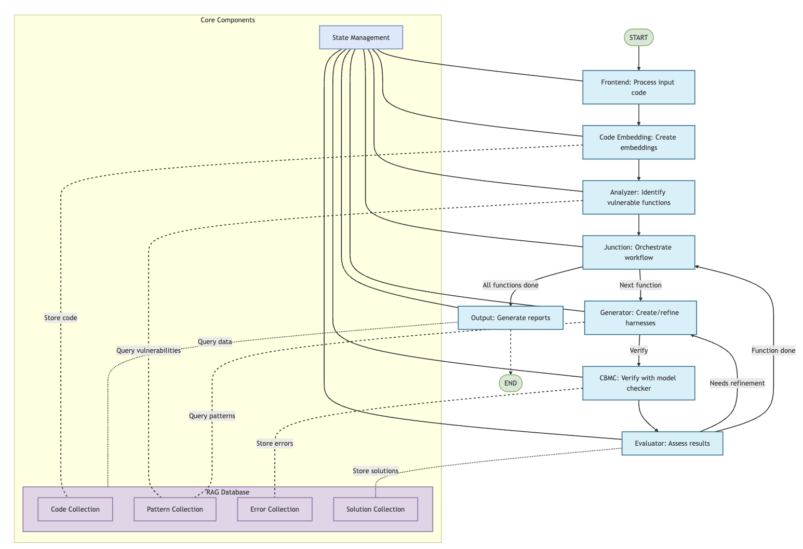

# CBMC Harness Generation System

An AI-powered tool for generating CBMC verification harnesses to detect memory and arithmetic issues in C code using advanced Language Model and Retrieval-Augmented Generation (RAG) techniques.

## Overview

This system leverages LangGraph workflows, Large Language Models (LLMs), and a sophisticated Knowledge Base to automatically:

1. Parse and analyze C source code
2. Identify functions with potential memory or arithmetic vulnerabilities
3. Generate CBMC-compatible verification harnesses
4. Run verification using CBMC
5. Iteratively refine harnesses based on verification results
6. Generate comprehensive, insightful reports with knowledge base learnings

### Key Detection Capabilities

The system excels at identifying complex issues in C code:
- Memory leaks and improper memory management
- Buffer overflows
- Null pointer dereferences
- Division by zero errors
- Integer overflow vulnerabilities
- Array bounds violations
- Type conversion issues
- Pointer arithmetic problems

## Architecture

The system employs a sophisticated multi-node workflow with advanced knowledge tracking:



### Core Components

- **Frontend Node**: Processes source code inputs
- **Code Embedding Node**: Extracts and vectorizes function information
- **Analyzer Node**: Identifies vulnerable functions
- **Junction Node**: Orchestrates sequential function processing
- **Generator Node**: Creates and refines verification harnesses
- **CBMC Node**: Executes verification checks
- **Evaluator Node**: Assesses harness quality and suggests improvements
- **Output Node**: Generates comprehensive reports

### Retrieval-Augmented Generation (RAG) Knowledge Base

The system maintains a dynamic knowledge base that:
- Stores code embeddings
- Tracks error patterns
- Manages solution strategies
- Provides intelligent recommendations
- Learns and adapts across verification attempts

### Workflow Process

1. Source code processed by Frontend
2. Code Embedding System extracts function information
3. Analyzer identifies vulnerable functions
4. Junction manages sequential function processing
5. Generator creates initial harnesses
6. CBMC verifies harness correctness
7. Evaluator assesses results and determines refinement needs
8. Iterative refinement using RAG insights
9. Generate comprehensive reports with knowledge base learnings

## Project Structure

```
cbmc-harness-generator/
├── main.py                      # Primary entry point
├── requirements.txt             # Python dependencies
├── setup.sh                     # Project setup script
│
├── core/                        # Core system components
│   ├── state.py                 # Workflow state definitions
│   ├── workflow.py              # LangGraph workflow configuration
│   └── embedding_db.py          # Embedding database management
│
├── nodes/                       # Workflow processing nodes
│   ├── frontend.py              # Initial source code processing
│   ├── code_embedding.py        # Function embedding generation
│   ├── analyzer.py              # Vulnerability analysis
│   ├── junction.py              # Processing orchestration
│   ├── generator.py             # Harness generation
│   ├── cbmc.py                  # CBMC verification execution
│   ├── evaluator.py             # Harness refinement
│   └── output.py                # Result reporting
│
├── utils/                       # Utility modules
│   ├── code_parser.py           # Advanced code parsing
│   ├── file_utils.py            # File handling utilities
│   ├── llm_utils.py             # LLM configuration
│   └── rag/                     # Retrieval-Augmented Generation
│       ├── db.py                # RAG knowledge base
│       └── patterns.py          # Vulnerability pattern recognition
│
├── results/                     # Runtime output directories
│   ├── harnesses/               # Generated verification harnesses
│   ├── verification/            # Detailed verification results
│   └── reports/                 # Summary and analysis reports
```

## Requirements

### System Requirements
- Python 3.9+
- CBMC (C Model Checker)
- One or more of the following LLM APIs:
  - Anthropic (Claude)
  - OpenAI (GPT)
  - Google (Gemini)

### Recommended Setup
- Virtual environment support
- Stable internet connection
- Minimum 16GB RAM recommended

## Installation

1. Clone the repository
```bash
git clone https://github.com/yourusername/cbmc-harness-generator.git
cd cbmc-harness-generator
```

2. Run the setup script
```bash
chmod +x setup.sh
./setup.sh
```

The setup script will:
- Verify Python version
- Check CBMC installation
- Create virtual environment
- Install dependencies
- Help configure API keys

## Usage Options

### Single File Analysis
```bash
# Default (uses Claude)
python main.py -f path/to/your/file.c

# Specify LLM
python main.py -f path/to/your/file.c --llm claude
python main.py -f path/to/your/file.c --llm openai
python main.py -f path/to/your/file.c --llm gemini
```

### Directory Analysis
```bash
python main.py -d path/to/your/project
```

### Advanced Options
```bash
# Set custom timeout
python main.py -f file.c --timeout 7200

# Enable verbose logging
python main.py -f file.c -v
```

## Output

### Generated Artifacts
- `results/harnesses/`: Generated verification harnesses
- `results/verification/`: Detailed CBMC verification results
- `results/reports/`: Comprehensive HTML and Markdown reports

### Report Features
- Function-level verification metrics
- Error pattern analysis
- Solution effectiveness tracking
- Vulnerability insights
- Knowledge base learnings

## Environment Configuration

### Required Environment Variables
- `ANTHROPIC_API_KEY`: Claude API Key
- `OPENAI_API_KEY`: OpenAI API Key
- `GOOGLE_API_KEY`: Google Gemini API Key

### Optional Configuration
- `TOKENIZERS_PARALLELISM`: Set to "false" to avoid warnings

## Known Limitations
- Requires active internet connection for LLM APIs
- Performance depends on LLM response quality
- Some complex codebases might require manual intervention

## License

[MIT License](LICENSE)

## Contributing

Contributions are welcome! Please submit pull requests or open issues to help improve the system.

## Acknowledgments
- CBMC Community
- LangChain and LangGraph Projects
- Anthropic, OpenAI, and Google for their LLM technologies

## Support

For issues, please [open a GitHub issue](https://github.com/yourusername/cbmc-harness-generator/issues).